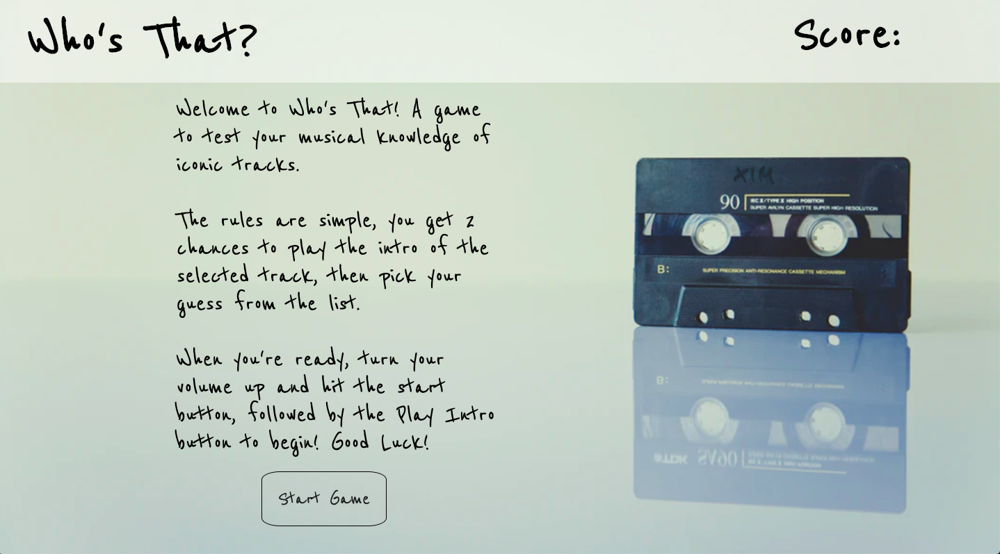
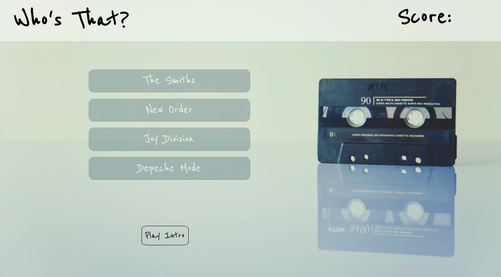
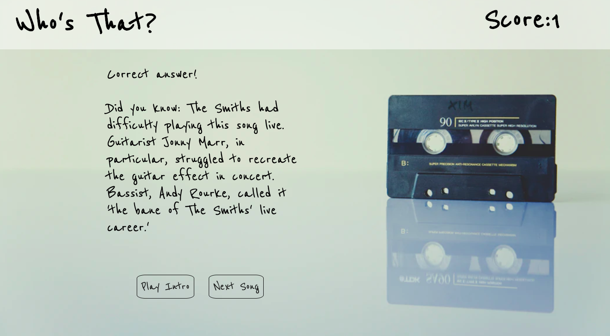
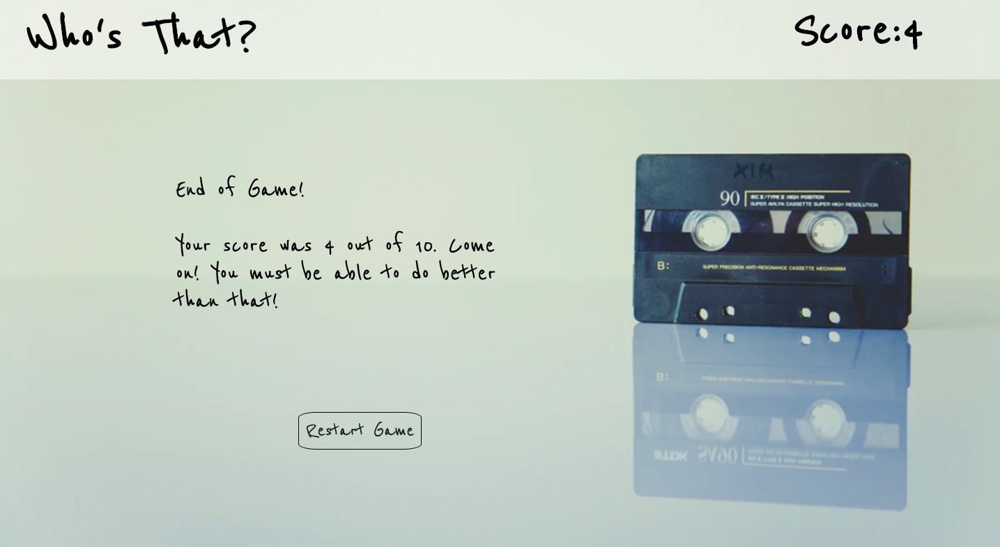

# Guess the Intro

I wanted to make this game because it's something I play with my wife on long drives, I've always been good at it and it makes me rekindle my love of certain genres that I may have neglected.

## Wireframe:

Welcome Page:

Guess page:

Fact Page:

End of Game page:

## Technologies Used: 
JavaScript
HTML
CSS
VS Code

## Get Started:

### Instructions: 
Play through the game by listening to each 5 second intro and selcting, from the list of options, which artist performed the song. You can hear each song a maximum of two times before making your pick. If you aren't happy with you're final score, hit the Restart Game button and play again.

### Game Link:

follow this link to play the game [https://msartain.github.io/guess-the-intro/]

## Future Enhancements

1. Change the 4 arrays into one array with objects.
2. Create a difficulty setting that provides harder songs/less time per song.
3. Add a song title guess selection as well as artist guess to earn extra points.
4. Add a media query to enable the user to play on any device.
5. Add a feature to enable the user to know the which songs they got wrong and what the asnwer was.
